<div align="center">


</div>

<div align="center">



<br/>


<br/><br/>

<a href="https://github.com/c-Murilo?tab=followers"></a>


</div>

<br/>

```console
$ whoami --verbose
```

```yaml
nome:      Murilo
local:     Londrina, Paraná — Brasil
trabalho:  Rocha e Rocha Advogados
status:    🎯 Focusing
faço:      transformo processo repetitivo em script,
           e planilha bagunçada em gráfico que decide coisa.
foco_2026: dados, automação e web bem feita
```

<br/>

<div align="center">

## `⚡ stack`

</div>

**Linguagens**

<p>


</p>

**Dados & automação**

<p>


</p>

**Back-end & ferramentas**

<p>


</p>

<br/>

<div align="center">

## `📊 números`


<br/>


<br/><br/>


</div>

<br/>

<div align="center">

## `🚀 projetos`

</div>

<table>
<tr>
<td width="50%" valign="top">

### 🤖 Automação

**[robo-emissor-nf](https://github.com/c-Murilo/robo-emissor-nf)** · `Python`
Robô que emite nota fiscal sozinho. Menos clique manual, mais tempo pra o que importa.

**[resumos-da-lu](https://github.com/c-Murilo/resumos-da-lu)** · `Python`
Geração automática de resumos.

</td>
<td width="50%" valign="top">

### 📈 Dados

**[Analise-de-Dados-de-Unicornios](https://github.com/c-Murilo/Analise-de-Dados-de-Unicornios-)** · `Jupyter`
O que as empresas bilionárias têm em comum?

**[Analise_de_Notas_Estudantes](https://github.com/c-Murilo/Analise_de_Notas_Estudantes)** · `Jupyter`
Impacto da escolaridade dos pais no desempenho dos alunos.

**[Analise-de-Filmes-Netflix](https://github.com/c-Murilo/Analise-de-Filmes-Netflix)** · `Jupyter`
Catálogo da Netflix virando insight.

**[Mapa-de-Densidade-de-Vendas](https://github.com/c-Murilo/Mapa-de-Densidade-de-Vendas-por-Cidade-Python)** · `Jupyter`
Heatmap geográfico de vendas por cidade.

</td>
</tr>
<tr>
<td width="50%" valign="top">

### 🌐 Web

**[page-maker-buddy-86](https://github.com/c-Murilo/page-maker-buddy-86)** · `TypeScript`
Construtor de páginas.

**[portfolio-dash](https://github.com/c-Murilo/portfolio-dash)** · `JavaScript`
Dashboard de portfólio.

**[Portfolio](https://github.com/c-Murilo/Portfolio)** · `CSS`
Minhas experiências e conhecimentos.

**[To_Do_List](https://github.com/c-Murilo/To_Do_List)** · `JavaScript`
Lista de anotações.

</td>
<td width="50%" valign="top">

### ⚙️ Back-end

**[Cadastro_User](https://github.com/c-Murilo/Cadastro_User)** · `JavaScript`
CRUD com Node + Sequelize, padrão MVC.

**[Car-registration-in-the-garage](https://github.com/c-Murilo/Car-registration-in-the-garage)** · `Node`
Registro de carros na garagem. CRUD, Sequelize, MVC.

</td>
</tr>
</table>

<div align="center">

<a href="https://github.com/c-Murilo?tab=repositories"></a>

</div>

<br/>

<div align="center">

## `📅 atividade`


</div>

<br/>

<div align="center">

## `📫 contato`

<a href="mailto:murilocorreia0101@gmail.com"></a>
<a href="https://github.com/c-Murilo"></a>

<br/><br/>

<i>“Se dá pra automatizar, não deveria ser feito à mão duas vezes.”</i>


</div>
